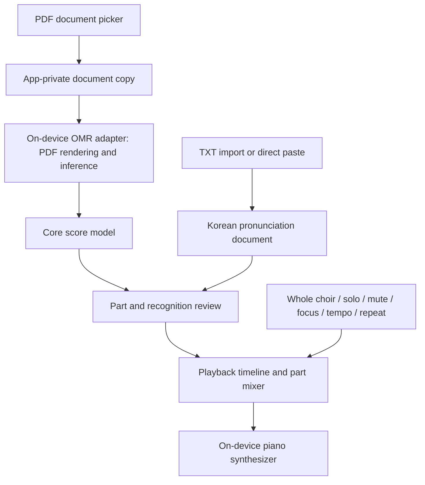

# Architecture

## Implemented input and PDF viewer

`app` depends on `core`; `core` has no dependency on Android or an OMR SDK. The app uses AndroidX `ComponentActivity`, Activity Result contracts, a retained `InputViewModel`, and XML resources. `DocumentImporter` performs content-provider I/O on `Dispatchers.IO`. UI collection follows the Activity lifecycle; imports survive rotation and are cancelled when the ViewModel is cleared. There is no recognition in the input flow.

The PDF/TXT buttons launch `ACTION_OPEN_DOCUMENT` with MIME filters and `EXTRA_LOCAL_ONLY`. PDF selection opens Android’s `PdfRenderer` and its first page off the main thread to check compatibility, then retains the URI, display name, and page count. Later pages are validated as they render. TXT decoding lives in the Android-independent `PronunciationText` helper: strict UTF-8, at most 64 KiB, no trimming, normalization, line-ending conversion, or BOM removal. Invalid/oversized input fails without replacing the previous text or filename. Provider streams/cursors are closed with `use`. Missing display names use a visible fallback.

The editor is disabled during imports to prevent concurrent edits from being overwritten. Pronunciation lives in memory, not saved-state Bundles, so long pasted text does not risk exceeding Android transaction limits. Rotation retains all fields; process death or finishing the input Activity clears pronunciation. `SelectedPdfStore` takes a read-only persistable URI grant when available, stores the last PDF URI in private preferences, and releases the previous grant after replacing the stored selection. Only a URI is stored, not the document bytes. Providers without persistent access still support session viewing, with an explicit UI notice. Startup checks the grant and opens the saved PDF off the UI thread; inaccessible selections are cleared with a recovery message. Durable pronunciation drafts and app-private PDF copying remain future work.

### PDF viewing

`PdfViewerActivity` is an internal, non-exported screen opened from the input screen. Its retained `PdfViewerViewModel` owns a `PdfDocumentSession`. The session serializes open, page rendering, and close using a mutex on `Dispatchers.IO`. There is at most one open `PdfRenderer.Page` at a time, and each is closed with `use`. Closing the viewer cancels its work and queues renderer/descriptor cleanup behind any in-flight native call. Native rendering cannot be interrupted mid-call; cancellation is checked around it.

A vertical `RecyclerView` creates only visible page rows; prefetch and the offscreen view cache are disabled. Detached or recycled rows cancel pending renders and clear their bitmap references. There is no full-document bitmap cache. Each rendered page is capped at 2,000,000 ARGB pixels (about 8 MB) and 4096 pixels per side, with dimensions calculated before allocation. These limits bound app-owned page rasters, not all memory used internally by Android’s PDF parser. Page sizes are read lazily rather than opening every page at startup.

A `HorizontalScrollView` provides sideways pan at discrete 100%, 150%, 200%, and 300% zoom. Changing zoom rerenders visible rows at the new requested width, subject to the bitmap cap. Fit width resets horizontal pan. The Activity saves its zoom level and the RecyclerView restores its page/scroll state across recreation; renderer ownership remains in the ViewModel. Pronunciation remains in the input ViewModel while the viewer is open.

Opening failures show a recovery message; per-page failures offer retry without discarding the selected document. This is a raster viewer: no OMR, text extraction, annotations, or remote rendering. It uses the platform [PdfRenderer](https://developer.android.com/reference/android/graphics/pdf/PdfRenderer); only AndroidX RecyclerView is added as a packaged dependency.

`Score` contains separately identified parts, each with a label, role, and note events. Roles include Descant, Soprano, Alto, Tenor, Bass, and Unknown; multiple parts can have the same role. MIDI pitches and quarter-note beat timing provide a minimal engine-neutral playback representation. Invalid pitches and non-finite or non-positive durations are rejected. This is not yet a complete notation interchange model: meter, tempo maps, ties, repeats, provenance, and lyric alignment need explicit extension before real OMR integration.

`OmrEngine.recognize` accepts an app-owned local PDF and returns a score with review warnings, a failure, or unavailable. `UnavailableOmrEngine` is the foundation implementation. There is no selected engine, inference runtime, model, server, or remote fallback. Implementations must manage dispatching, cancellation, PDF rasterization, and temporary resources without leaking their SDK types into the core contract.

## Planned data flow

This diagram describes the target flow. The picker and pronunciation editor are implemented; PDF viewing and last-document URI persistence are also implemented. PDF copying, recognition, review, pronunciation/score persistence, and playback remain planned.

## Import and recognition

Use Android's Storage Access Framework for PDF/TXT selection, validate input, and copy PDFs to app-private storage before recognition. Bound page dimensions, page count, and memory consumption; render pages incrementally. Surface encrypted, malformed, or unsupported PDFs as actionable failures. Keep recognition jobs independent from Activity recreation and cancel/release work safely.

Evaluate engines behind adapters using the same permitted fixtures. Assess notation accuracy, staff/voice separation, Kotlin/Android integration, offline packaging, model licensing, ARM64 Galaxy performance, emulator compatibility, peak memory, and cancellation behavior. Native adapters may need both arm64-v8a and x86_64 for development. No engine is approved by this architecture document.

Treat role assignment as uncertain: preserve unknown labels and allow correction, including divisi and shared staves. Never assume that staff order alone determines choir role. Preserve useful warnings for user review; extend the contract with structured confidence and provenance when an evaluated engine requires them.

## Pronunciation

Support UTF-8 TXT (including BOM) and direct paste first, retaining Korean Unicode and line boundaries. Report decoding failures instead of silently corrupting text. Keep pronunciation separate from recognized notes until users can review alignment. Define other encodings only with explicit product requirements.

## Playback

Convert reviewed notes into a deterministic timeline before synthesis. Use a monotonic audio clock; keep I/O and allocation away from the audio callback. Decide ties, tempo maps, and repeat expansion before implementing full score playback. Obtain a suitably licensed bundled piano sound source.

Whole choir restores all parts; solo selects one audible part; mute excludes selected parts; focus keeps the selected part prominent with reduced accompaniment. Define precedence and gains in tests when implementing the mixer. Tempo changes alter beat-to-time mapping, and repeat controls loop a validated range with all notes released at boundaries. Handle audio focus, interruptions, route changes, and lifecycle stop/release.

## Storage and privacy

The last PDF URI is persisted now. Persist pronunciation, reviewed scores, and practice settings locally in a later milestone. Do not log score contents or send them to services. The manifest has no network/storage permissions, disables backup, and excludes app data from Android 12+ cloud/device transfers; revisit explicit backup behavior only when persistence is designed. Keep engine artifacts and user data out of source control.
