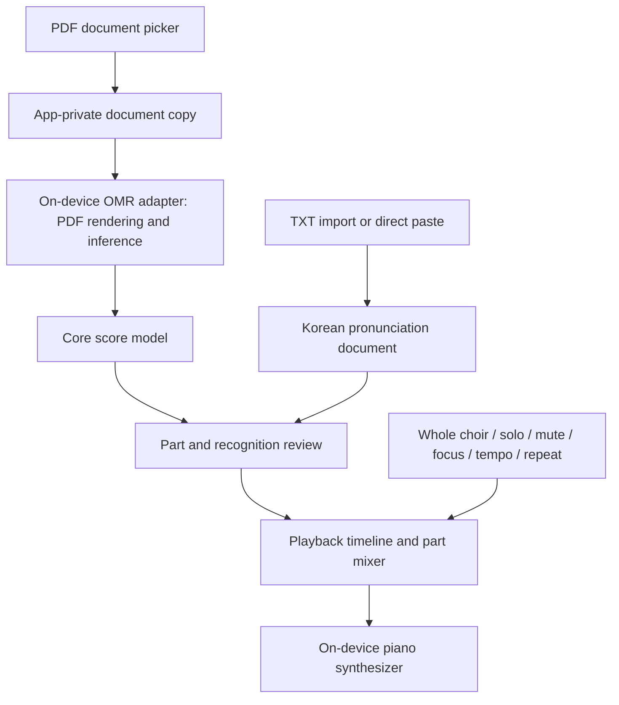

# Architecture

## Implemented foundation

`app` depends on `core`; `core` has no dependency on Android or an OMR SDK. The app uses a small platform Activity and XML resource layout to avoid committing to a large UI framework before the practice workflow is implemented. UI code does not perform recognition.

`Score` contains separately identified parts, each with a label, role, and note events. Roles include Descant, Soprano, Alto, Tenor, Bass, and Unknown; multiple parts can have the same role. MIDI pitches and quarter-note beat timing provide a minimal engine-neutral playback representation. Invalid pitches and non-finite or non-positive durations are rejected. This is not yet a complete notation interchange model: meter, tempo maps, ties, repeats, provenance, and lyric alignment need explicit extension before real OMR integration.

`OmrEngine.recognize` accepts an app-owned local PDF and returns a score with review warnings, a failure, or unavailable. `UnavailableOmrEngine` is the foundation implementation. There is no selected engine, inference runtime, model, server, or remote fallback. Implementations must manage dispatching, cancellation, PDF rasterization, and temporary resources without leaking their SDK types into the core contract.

## Planned data flow

This diagram describes the target flow, not implemented functionality.

## Import and recognition

Use Android's Storage Access Framework for PDF/TXT selection, validate input, and copy PDFs to app-private storage before recognition. Bound page dimensions, page count, and memory consumption; render pages incrementally. Surface encrypted, malformed, or unsupported PDFs as actionable failures. Keep recognition jobs independent from Activity recreation and cancel/release work safely.

Evaluate engines behind adapters using the same permitted fixtures. Assess notation accuracy, staff/voice separation, Kotlin/Android integration, offline packaging, model licensing, ARM64 Galaxy performance, emulator compatibility, peak memory, and cancellation behavior. Native adapters may need both arm64-v8a and x86_64 for development. No engine is approved by this architecture document.

Treat role assignment as uncertain: preserve unknown labels and allow correction, including divisi and shared staves. Never assume that staff order alone determines choir role. Preserve useful warnings for user review; extend the contract with structured confidence and provenance when an evaluated engine requires them.

## Pronunciation

Support UTF-8 TXT (including BOM) and direct paste first, retaining Korean Unicode and line boundaries. Report decoding failures instead of silently corrupting text. Keep pronunciation separate from recognized notes until users can review alignment. Define other encodings only with explicit product requirements.

## Playback

Convert reviewed notes into a deterministic timeline before synthesis. Use a monotonic audio clock; keep I/O and allocation away from the audio callback. Decide ties, tempo maps, and repeat expansion before implementing full score playback. Obtain a suitably licensed bundled piano sound source.

Whole choir restores all parts; solo selects one audible part; mute excludes selected parts; focus keeps the selected part prominent with reduced accompaniment. Define precedence and gains in tests when implementing the mixer. Tempo changes alter beat-to-time mapping, and repeat controls loop a validated range with all notes released at boundaries. Handle audio focus, interruptions, route changes, and lifecycle stop/release.

## Storage and privacy

Persist imported documents, pronunciation, reviewed scores, and practice settings locally once the repository layer exists. Do not log score contents or send them to services. The initial manifest has no network/storage permissions and disables backup; revisit explicit backup behavior only when persistence is designed. Keep engine artifacts and user data out of source control.
